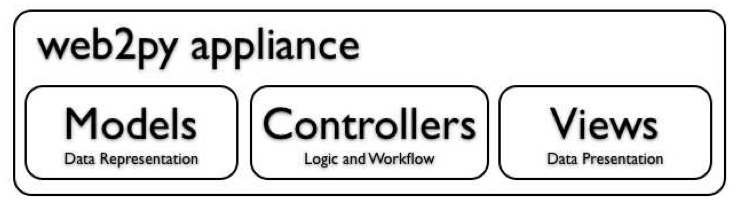
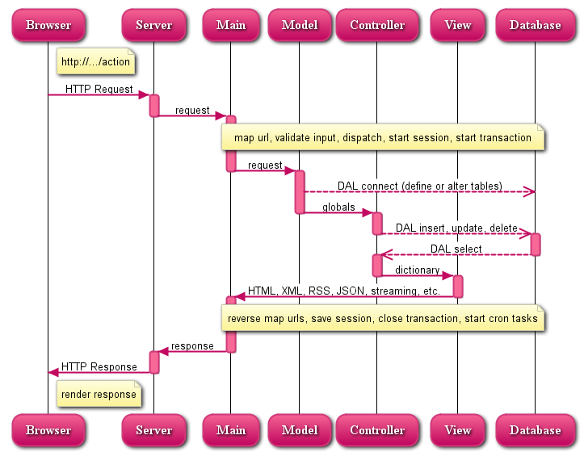

模型、视图、控制器（Model View Controller）
============================================
WEB2PY强迫开发者分开数据层（Model），显示层（View）以及控制器（Controller）。让我们再考虑一下之前的例子，看看怎么围绕该例子创建WEB2PY应用。

|model_view_controllers|

典型的WEB2PY中的用户请求处理过程如下：

|workflow_diagram|

图表说明：
"""""""""""""""""""""""

- 服务器（Server）既可以是WEB2PY的内嵌Web server也可以是第三方的服务器，例如Apache。服务器负责处理多线程。
- Main是WEB2PY WSGI程序中的main。它负责所有常见任务以及封装用户程序。它还负责处理cookies，sessions，事务（transactions），URL地址解析和反向解析，分发器（根据URL决定那个方法应该被调用）。如果Web服务器没有处理的话，它还能处理静态文件。
- 模型、视图、控制器组成了用户的软件。同一个WEB2PY实例下可以运行多个用户软件。
- 带有箭头的虚线代表同数据库引擎之间的通信
- 数据库查询可以直接写SQL语句（不推荐）或使用WEB2PY的数据库抽象层（推荐），WEB2PY下的代码不依赖于任何一种特定的数据库引擎。
- 分发器（Dispatcher）将请求的URL地址对应成相应的控制器的函数调用。函数的输出可以是字符串或字典字符（使用哈希表）。字典中的数据被视图（View）渲染。如果用户请求的是HTML页面（默认情况），字典中的数据将被渲染成HTML页面。如果相同的URL用户请求的是XML格式，WEP2PY将会试图找到一个能够将字典数据渲染成XML格式的视图。开发者可以创建视图渲染页面到任何已经支持的协议（HTML，XML，JSON，RSS，CSV，RTF）或创建新的自定义协议。
- 所有的调用都会被包含在一个事务之中，没有处理的例外将会导致事务回退。如果请求成功，事务将会被提交。
- WEB2PY还能自动处理sessions和session cookies，当事务提交的时候，相应的session也被保存。
- 还支持将重复的任务注册并定时执行，或者在某些事件发生的时候运行。用这种方式可以把需要时间很长的计算密集型任务放在后台运行，而不会影响用户继续浏览前台页面。

如下是一个最简单的，包含三个文件，采用MVC架构的程序：

·“db.py”是数据层：

::

	db = DAL('sqlite://storage.sqlite')
	db.define_table('contacts',
		Field('name'),
		Field('phone'))

它负责数据库连接（在本例中，SQLite数据库存储于storage.sqlite文件中），还定义了一个名为contacts的表格。如果该表格在数据库中不存在，WEB2PY将会创建它，这一切都是在后台执行的，对于用户完全透明，WEB2PY对于不同的数据库引擎，能生成想应的SQL语句。开发者能够看到生成的SQL语句，但是无需修改数据库端的任何代码，默认的数据库是SQLite不过，用户能够改用MySQL、PostgreSQL、MSSQL、FireBird、Oracle、DB2、Informix或谷歌App Engine中的Big Table。

当表格定义好并创建好之后，WEB2PY还会生成功能齐全基于Web的数据库管理界面。该界面叫做appadmin，可以通过它访问数据库和表格。

·“default.py”是控制器：

::

	def contacts():
		return dict(records=db().select(db.contacts.ALL))

在WEB2PY中，URL地址被映射到Python组建或函数调用。在上面的例子中，控制器中包含一个叫做contacts的函数（行为）。该函数的返回值类型为字符串或Python字典（一组相互对应的索引和值）。当返回值类型为字典时，返回值将会被传递到一个和控制器或函数同名的视图，该视图负责渲染该字典。在上述例子中，名为contacts的从数据库中通过select选中并返回记录，返回值类型为索引和值相互对应的字典对象。

·“default/contacts.html”是视图：

::

	{{extend 'layout.html'}}
	<h1>Records</h1>
	{{for record in records:}}
	{{=record.name}}: {{=record.phone}} 
	{{pass}}

在相对应的控制器（行为）执行后，上述视图将被WEB2PY自动调用。该视图用于把返回值字典中的记录渲染成为HTML。视图是用HTML语句编写的，不过其中内嵌的Python代码包含在，特殊字符{{和}}之间。这种方式同PHP代码有所不同，因为HTML内嵌的只有“表示层”代码。视图代码第一行所包含的“layout.html”文件，是由WEB2PY框架提供的，其中包含所有WEB2PY软件布局要用到的基本代码。该布局可以很很容易的被修改或替换。