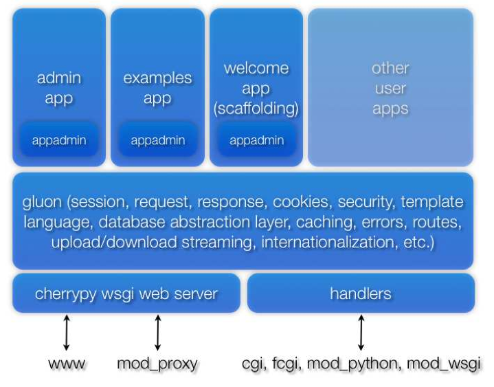

框架内容
============================================
你可以通过访问以下官方网站下载WEB2PY：

http://www.web2py.com

WEB2PY由如下组件构成：
"""""""""""""""""""""""

- 库：提供了编程能够访问的WEB2PY核心功能。

- Web服务器：CherryPy WSGI Web Server

- 管理界面程序：可以用来设计、创建和管理其他WEB2PY程序。管理界面提供了一套完整的，基于Web的集成开发环境（Integrated Development Environment），可以用来开发WEB2PY应用。它还包括其他功能，例如基于WEB的测试和命令窗口。

- 示例程序：包括文档和交互示例。example是官方WEB2PY网站的副本，并且包含了epydoc和Sphinx文档。

- 欢迎程序：这是一个基本模板。默认采用纯CSS的层叠菜单和用户认证（将在第八章详细讨论）。

WEB2PY的分发包括源代码和支持微软windows或苹果Mac OS X编译后的二进制代码。

源代码可以在任何支持Python或Jython的平台上运行，并且包含了上述所有组件。运行源代码之前，先要安装Python 2.5.你还需要安装一种框架支持的数据库引擎。为了测试和轻量化的需要，你可以使用Python 2.5包含的SQLite数据库。

二进制编译版本的WEB2PY（支持Windows或Mac OS X）已经包含了Python 2.5解释器以及SQLite数据库。从本质上说，这两个部分并不是WEB2PY的内部组件。包含他们的目的就是让用户在下载二进制编码的版本后，能够直接运行WEB2PY。

下面的图示描述了WEB2PY的架构：

|1.6|