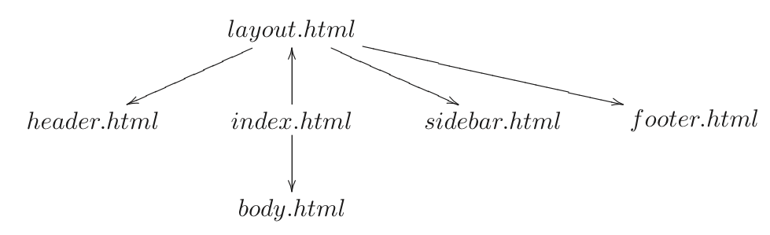

页面布局
============================================

一个模板文件可以继承和包含其他的模板文件，从而形成一个类似于树的结构。如下图所示，向上的箭头意味着继承，向下的箭头意味着包含。

|layout_tree|

在这个例子里面，模板“index.html”继承了“layout.html”，包含了“body.html”。而“layout.html”包含了“header.html”、“sidebar.html”、“footer.html”。

这棵树的根节点，我们通常称之为“布局视图”。就像其他的HTML模版文件一样，你可以在WEB2PY的管理界面中编辑它。而“layout.html”这个名字只是约定俗成而已。

下面是一个最小的页面示例，既继承自“layout.html”，有包含了“page.html”。

::

    {{extend'layout.html'}}
    <h1>HelloWorld</h1>
    {{include'page.html'}}

所有被继承的模版文件必须包含一个“{{include}}”辅助函数，就像以下代码所示：

::

    <html><head><title>PageTitle</title></head>
        body>
            {{include}}
        </body>
    </head>

当模板被加载的时候，“{{include}}”会被替换成对应的代码。整个过程会被递归执行，直到所有的继承和包含都被处理了。然后模板就会被转换成对应的Python代码惊醒执行。

需要注意的是，extend和include只是表明模板的方向，不是Python的命令。

布局的作用是是用来封装页面中的相同部分的，虽然不是必须的，不过这样做的话，可以使页面易于编写和维护。特别的，我们建议在编写布局的时候，使用以下的变量，这样可以让编写的布局更加通用：

::

    response.title
    response.subtitle
    response.author
    response.keywords
    response.description
    response.flash
    response.menu

这些变量都是字符串。他们的意义就像名字一样显而易见，除了response.menu。response.menu是一个有3元元组组成的列表。元组里面的3个元素代表的含义分别是：链接名、一个布尔值用来标记链接是否是起作用的（就是是否是当前的链接）、链接向页面的URL。下面举个例子：

::

    response.menu = [['Google', False', 'http://www.google.com'], 
                ['Index', True, URL(r=request, f='index')]]

我们也推荐你在模板的HTML头部加上下面的代码：

::

    {{include 'web2py_ajax.html'}}

这个html中包含了jQuery库，然后定义了一系列向后兼容的JavaScript函数，用来实现一些特殊的效果和Ajax。

下面是一个小型“layout.html”的实现，符合我们刚才推荐的做法：

::
    
    <!DOCTYPEhtmlPUBLIC "-//W3C//DTDXHTML1.0Strict//EN" "http://www.w3.org/TR/xhtml1/DTD/xhtml1-strict.dtd">
    <html xmlns="http://www.w3.org/1999/xhtml" xml:lang="en" lang="en">
    <head>
        <!-- define the meta tags -->
        <meta http-equiv="content-type" content="text/html; charset=utf-8" />
        <meta name="keywords" content="{{=response.keywords}}" />
        <meta name="description" content="{{=response.description}}" />
        <meta name="author" content="{{=response.author}}" />

        <!-- choose a title or use the application name --> 
        <title>{{=response.title or request.application)}}</title>
        
        <!-- include jQuery and other ajax functions -->
        {{include 'web2py_ajax.html'}}
        
        <!-- include a style.css file and optional js files -->
        <link href="{{=URL(r=request, c='static', f='style.css')}}"
                rel="stylesheet" type="text/css"/>
    </head>
    <body>
    
    <!--build your header-->
    
[Here goes the header]

    
    <!--here is the menu-->
    {{ifresponse.menu:}}
    

    <ul>
        <!-- loop over menu items -->
        {{=for _name, _active, _link in response.menu:}}
            <li><a href="{{=_link}}" class="{{='active' if _active else 
                'inactive'}}">{{=_name}}</a></li>
        {{pass}}

    </ul>
    

    {{pass}}
    
    <!--here is the flash message-->
    
{{=response.flash or ''}}

    
    <!--here the extending view is included-->
    {{include}}
    
    <!--here is the footer-->
    
[created by {{=response.author}} with web2py]

    </body>
    </html>
    
在布局的时候，有时候需要在子模板里面显示变量。实现的方法就是把变量定义在“继承”操作的前面。这样的话，这些变量就可以在多个地方使用了。根据这个思路，我们可以在模板里面定义一些函数来生成一个页面的不同部分（比如主体，导航条等等），然后在不同的布局中渲染他们。这些函数会在模板渲染的时候调用。

下面是一个布局示例：

::

    <html><body>
    {{include}} <!--must come before the two blocks below -->
    whatever html
    {{maincontent()}}
    whatever html
    {{if 'sidebar' in globals(): sidebar()}}
    whatever html
    </body></html>

“maincontent”函数和“sidebar”函数都在子模板里面定义。尽管在这个例子里面，我们允许模板没有定义“sidebar”函数。下面是相关的模板：

::

    {{def sidebar():}}
    <h1>This is the sidebar</h1>
    {{return}}
    {{def maincontent():}}
    <h1>This is the maincontent</h1>
    {{return}}
    {{extend'layout.html'}}

需要注意的是，这些函数是在HTML里面被定义的（尽管他们可以包含Python代码），所以他们直接调用response.write方法将生成的内容写进response里面，而不是将生成的内容返回。所以，在模板里面调用这些方法的时候，需要用{{maincontent()}}而不是{{=maincontent()}}。
