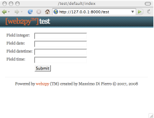
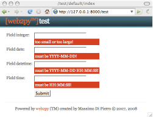
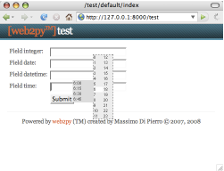
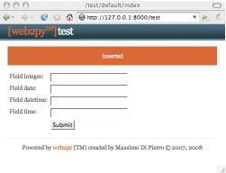

.. |form_test_datetimepicker| image:: ../_static/form_test_datetimepicker.png

web2py_ajax.html
================
默认的WEB2PY应用“welcome”包含了一个文件名"web2py_ajax.html"的文件，位置在：

::

    views/web2py_ajax.html

这个文件被包含在默认的"layout.html"的HEAD域，并且，它提供了以下功能：

- 包含了 *static/jquery.js* 文件。
- 包含了 *static/calendar.js* 和 *static/calendar.css* 2个文件，如果它们存在的话。
- 定义了一个 *popup* 函数。
- 定义了一个 *collapse* 函数（基于jQuery slideToggle）。
- 定义了一个 *fade* 函数（基于jQuery fade）。
- 定义了一个 *ajax* 函数（基于jQuery $.ajax）。
- 使任何class属性拥有"error"的DIV标记和任何class属性拥有"flash"的标记有滑动效果。
- 防止在class属性拥有"integer"的输入框内输入不正确的整数。
- 防止在class属性拥有"double"的输入框内输入不正确的浮点数。
- 为类型为"date"的输入框提供了一个弹出式的date选择器。
- 为类型为"datetime"的输入框提供了一个弹出式的datetime选择器。
- 为类型为"time"的输入框提供了一个弹出式的time选择器。

*popup*, *collapse* 和 *fade* 三个函数被包含仅仅是为了向后兼容，在本书中不做讨论。

以下是一个例子，展示了怎样让这些特效能够在一起很好的工作。

考虑一个名叫"test"的项目，它首先包含以下的model：

::

    db = DAL("sqlite://db.db")
        db.define_table('mytable',
        Field('field_integer', 'integer'),
        Field('field_date', 'date'),
        Field('field_datetime', 'datetime'),
        Field('field_time', 'time'))

然后包含以下的一个名叫"default.py"的controller：

::

    def index():
        form = SQLFORM(db.mytable)
        if form.accepts(request.vars, session):
            response.flash = 'record inserted' 
        return dict(form=form)

最后以下的一个位置在"default/index.html"的view：

::

    {{extend 'layout.html}}
    {{=form}}

名为"index"的action会生成以下的表单：

|form_test_empty|

如果一个错误的表单被提交了，服务器就会返回一个页面，包含了一个含有错误提示信息的表单。这些错误信息是一些class属性为"error"的DIV标签，并且，因为上面提到的 *web2py_ajax* 代码，这些错误是显示为一个向下滑动的特效：

|form_test_errors|

决定这些错误信息的颜色的CSS代码在"layout.html"里面。

这些 *web2py_ajax* 代码防止你在输入框里面输入错误的值。这些操作并不是替代了服务器端的验证，而是作为对服务器端验证的补充。

这些 *web2py_ajax* 代码在你点击一个class属性为date的输入框的时候显示一个日期选择器，在你点击一个class属性为datetime的输入框的时候显示一个时间日期选择器。下面是一个例子：

|form_test_datetimepicker|

这些 *web2py_ajax* 代码同样在你点击一个class属性为time的输入框的时候的时候显示一个如下的时间选择器：

|form_test_timepicker|

每当你提交表单的时候，controller会返回一个内容为"record inserted"的名叫"flash"的消息。默认的层渲染器会把这个消息放在一个id值为"flash"的DIV标签中。而同时，*web2py_ajax* 代码会负责的把这个DIV标签向下滑动，并且当你点击的时候，会自动产生让它消失的效果：

|form_test_flash|

以上示例中的效果以及其他效果是可以直接在views或者通过helpers在controller里面调用的。
