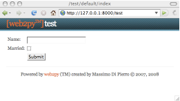
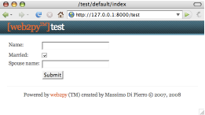
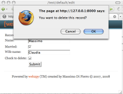

jQuery 特效
===========

使用jQuery的特效是意见非常容易的事。在这里，我们简单描述一下如何去做。

这些最基本的效果不需要任何额外的文件就能运行，你所需要的仅仅只是我们再上一节中提到的web2py_ajax.html。

任何一个 HTML/XHTML的对象都可以根据他们的类型（比如说DIV），class属性或者id属性区分。举个例子：

::

    
Hello

    
World

他们的class属性分别为"one"和"two"。同时，他们的id属性也不同，分别是"a"和"b"。

在jQuery里面，你可以用类似CSS的选择器来选择某一个标签。比如你可以用以下的语句选择上面两个DIV中的前一个：

::

    jQuery('.one')      //根据class属性'one'定位到对象
    jQuery('#a')        //根据id属性'a'定位到对象
    jQuery('DIV.one')   //根据类型'DIV'和class属性'one'共同定位到对象 
    jQuery('DIV #a')    //根据类型'DIV'和id属性'a'共同定位到对象 

也可以用以下的语句选择后一个：

::

    jQuery('.one')	
    jQuery('#a')	
    jQuery('DIV.one')   
    jQuery('DIV #a')    

或者你也可以用下面的语句同时获得2个对象：

::

    jQuery('DIV')

众所周知，标签对象可以绑定到诸如"onclick"之类的事件上。jQuery可以把这些事件绑定到指定的特效上面，比如著名的"slideToggle"：

::
    
    
Hello 

    
World

现在，好玩的事情将要发生了，如果你单击"Hello"，"World"会消失。再单击一下，它就会出现。

你也可以把这些事件的绑定到其他的函数当中。我们重写上面的代码：

::

    
Hello

    
World

     
    
jQuery对象的成员函数执行以后会返回调用它所属对象，所以一连串的函数调用可以连接起来，在调用完一个以后接着调用另一个。

顾名思义，click函数会在其绑定的对象被单击的时候被执行。类似的函数还有change，keyup，keydown，mouseover等等。

有时候我们常常会需要在页面加载完毕以后立刻执行这个某些JavaScript函数，这时候就需要设置BODY标签的onload属性了。jQuery提供了一个更好的选择来实现这个功能：

::
    
    
Hello

    
World

    

注意，以上函数只有在页面被完整加载完毕以后才会被执行。

**下面罗列一些有用的事件名字：**

表单事件：
"""""""""""""""""""""""

- onchange：在元素被改变的时候执行。
- onsubmit：在表单被提交的时候执行。
- onreset：在表单被重置的时候执行。
- onselect：在元素被选择的时候执行。
- onblur：在元素失去焦点的时候执行。
- onfocus：在元素获得焦点的时候执行。

键盘事件：
""""""""""""""""""""""""

- onkeydown：在键盘按下的时候执行。
- onkeypress：在键盘按下然后释放之后执行。
- onkeyup：在键盘释放后执行。

鼠标事件：
""""""""""""""""""""""""

- onclick：在鼠标单击的时候执行。
- ondblclick：在鼠标双击的时候执行。
- onmousedown：在鼠标按钮按下的时候执行。
- onmousemove：在鼠标指针移动的时候执行。
- onmouseout：在鼠标指针移出元素的范围的时候执行。
- onmouseover：在鼠标指针移过元素的时候执行。
- onmouseup：在鼠标的按钮释放的时候执行。

**下面罗列一些jQuery定义的特效：**

特效：
""""""""""""""""""""""""

- jQuery(...).attr(name)：返回名字是name的属性的值（译者注：这里原文是"Returns the name of the attribute value"，即使“返回某个属性的名字”。译者查阅jQuery手册后发现，该函数的实际作用是返回名字是name的某个属性的值）。。
- jQuery(...).attr(name, value)：设置某个名字是name的属性的值为value（译者注：这里原文是"Sets the attribute name to value"，即使“设置name属性的值为value”。译者查阅jQuery手册后发现，该函数的实际作用是设置某个名字是name的属性的值为value）。
- jQuery(...).show()：让对象可见。
- jQuery(...).hide()：隐藏对象。
- jQuery(...).slideToggle(speed, callback)：让对象向上滑动或者向下滑动。
- jQuery(...).slideUp(speed, callback)：让对象向上滑动。
- jQuery(...).slideDown(speed, callback)：让对象向下滑动。
- jQuery(...).fadeIn(speed, callback)：让对象渐入。
- jQuery(...).fadeOut(speed, callback)：让对象渐出。

speed参数常常是"slow"，"fast"，或者缺省不填。callback参数是一个可选参数，内容是想要当特效执行完毕以后执行的函数。

jQuery特效可以轻易地被嵌入到helper里面，比如说在一个view里面有如下代码是很常见的：

::

    {{=DIV('clickme!', _onclick="jQuery(this).fadeOut()")}}

jQuery是一个非常简明紧凑的Ajax框架，因此WEB2PY不需要一个在jQuery上面加一个额外的抽象层（除了下面将会提到的ajax函数）。jQuery的API是非常容易使用的，所以你可以查阅jQuery的文档以获得更多的关于上面提及的特效或者其他的API的信息。

另外，jQuery有很多的插件和用户界面组件供人选择使用。这些不在本书的讨论范围之内。可以查看69号索引。

表单中的条件域
^^^^^^^^^^^^^^^^^^^^^^^^^^^^^^

jQuery特效的一个典型应用场合就是：根据表单里面各种域的值来更改表单的显示。

这个应用在WEB2PY里面非常容易实现，因为SQLFORM可以很方便根据CSS的生成表单。这种表单实际上是一个table，表格是由是由许多行组成的，每一行都包含一个label，一个input field，以及一个可以选择的第三列。每一项都有一个根据table和field名字决定的独一无二的id来区分。

按照惯例，每个INPUT域都有一个名字叫做 *tablename_fieldname* ，并且它包含一行名叫 *tablename_fieldname_row* 的行。

下面我们将举一个例子来说明这个。这个例子表单，用来输入纳税人的姓名，以及他的配偶。当然，如果他没有结婚的话，是不用输入的。:)

首先建立一个名叫test的应用，添加如下的model：

::

    db = DAL('sqlite://db.db')
    db.define_table('taxpayer',
        Field('name'), 
        Field('married', 'boolean'), 
        Field('spouse_name'))
    
然后建立下面这个名叫"default.py"的controller：

::

    def index():
        form = SQLFORM(db.taxpayer)
        if form.accepts(request.vars, session):
            response.flash = 'record inserted'
        return dict(form=form)

然后再建立位置在"default/index.html"的view：

::

    {{extend'layout.html'}}
    {{=form}}
    

在view里面的脚本有一个很好的效果，那就是隐藏输入配偶姓名的那一行：

|form_unmarried|

而当你选中了"married"，那么输入配偶姓名的输入框就会出现了：

|form_married|

按照上面所说的表单和table定义关系，名叫"taxpayer_married"的checkbox被关联到名叫"taxpayer"的table的"married" field，因为"married" field是"boolean"类型的，所以它表现为一个checkbox。同理，名叫"taxpayer_spouse_name_row"的那个行对应到"spouse_name"。

删除确认
^^^^^^^^^^^^^^^^^^^^^

另外一个典型应用场合是当你删除一个项目的时候，会对你的行为进行确认。

考虑下面这样一个例子，首先，写一个controller action：

::

    def edit():
    row = db(db.taxpayer.id==request.args[0]).select()[0] 
    form = SQLFORM(db.taxpayer, row, deletable=True)
    if form.accepts(request.vars, session):
        response.flash = 'record updated'
    return dict(form=form)

然后写一个view，位置放在"default/edit.html"：

::

    {{entend 'layout.html'}}
    {{=form}}
  
如果你在SQLFORM的构造函数里面加上 *deletable=True* 的参数，那么WEB2PY就会在你编辑表单的时候显示一个"delete"选项框。

在"web2py_ajax.html"里面添加以下的代码：

::

    jQuery(document).ready(function(){
        jQuery('input.delete').attr('onclick',
        'if(this.checked) if(!confirm(
            "{{=T('Sure you want to delete this object?')}"}))
        this.checked=false;'
    });

按照惯例，这个checkbox的class属性值会被设置为"delete"。上面的jQuery代码绑定了这个checkbox的onclick事件，产生的效果就是，如果你选中了这个checkbox，那么浏览器就会提醒你是否确认。如果你选择了确认，checkbox会保持选中的状态，如果不确认，checkbox就会被重置清空。如下图所示：

|form_married_delete|

