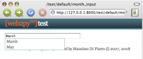

ajax函数
===========

在“web2py_ajax.html”里面，WEB2PY定义了一个名叫 *ajax* 的函数。它基于jQuery的名叫 *$.ajax* 的函数。别小看这个简单的“$”字母，它比你想象的要有用。关于它可以参考31号参考和68号参考。尽管如此，我们还是建议使用前者因为它足够应付复杂的应用，而且要更加容易使用。

*ajax* 函数是一个JavaScript函数，它定义为如下形势：

::

    ajax(url, [id1, id2, ...], target)

它的整个运作过程是这样的，首先异步调用url（第一个参数），然后根据id列表（第二个参数），把所有id属性值在id列表里面的域的值传送到服务端，最后找到id值为target（第三个参数）的域，把它的innerHTML设置成服务器端的返回值。

下面给出一个名叫“default”的controller的样例：

::
    
    def one():
        return dict()

    def echo():
        return request.vars.name

接着给出与他相关的位置在“default/one.html”的view：

::

    {{extend'layout.html'}}
    <form>
        <input id="name" onkeyup="ajax('echo', ['name'], 'target')" />
    </form>
    

当你在INPUT域里面输入一些内容的时候，在释放按键的一瞬间（onkeyup），*ajax* 函数被调用，id="name"的域的值被传到名叫“echo”的action，然后从服务器把文本传输回来。最后， *ajax* 函数接收返回值然后把它显示在“target”DIV里面。

执行目标
--------------

ajax函数的第三个参数可以是一个字符串“:eval”。这就意味着，从服务器端返回的数据不会被插入到HTML文档当中，而是会被执行。

我们设计一个示例，首先写一个名叫“default”的controller：

::

    def one():
        return dict()
 
    def echo(): 
        return "jQuery('#target').html(%s);" % repr(request.vars.name)

然后设计一个位于“default/one.html”的view：

::

    {{extend'layout.html'}}
    <form>
        <input id="name" onkeyup="ajax('echo', ['name'], ':eval')" />
    </form>
    

这样做的目的就是让返回值能够产生更大的作用，而不是仅仅是返回一个字符串那么简单。

自动补全
---------------

另一个典型的 *ajax* 函数的应用是自动补全。什么叫自动补全？我们希望完成这样的一个功能：假设有一个输入框需要输入月份的名字，当用户在这个框里面输入内容的时候， *ajax* 函数会自动的把信息发送给服务器，然后获得与用户输入相似的结果，在输入框下面显示一个小框提示用户，还能让用户选择合适的结果。这就叫自动补全。

为了实现功能，我们首先编写一个名叫“default”的controller：

::

    def month_input():
        return dict()

    def month_selector(): 
        if not request.vars.month:
            return '' 
        months = ['January', 'February', 'March', 'April', 'May',
                'June', 'July', 'August', 'September' ,'October',
                'November', 'December']
        selected = [m for m in months \
                    if m.startswith(request.vars.month.capitalize())]
        return ''.join([DIV(k,
                        _onclick="jQuery('#month').val('%s')" % k, 
                        _onmouseover="this.style.backgroundColor='yellow'", 
                        _onmouseout="this.style.backgroundColor='white'"
                        ).xml() for k in selected])

然后建立“default/month_input.html”作为view：

::

    {{extend'layout.html'}}
    

    <form>
        <input type="text" id="month" style="width: 250px" /> 
        

    </form>
    

以上的jQuery代码是这样运作的。首先设置了一个触发器，当用户在“month”输入框里面输入内容的时候，该输入框的值会被异步提交到“month_selector”方法处理。该方法搜索出一个以用户输入的字符串开头的月份名字的列表，然后根据列表创建一个DIV对象列表（每一个对象包含一个月份名字），最后服务器端把这个DIV列表序列化以后传回客户端。然后客户端接收到这个序列化以后，把它显示在一个id是“suggestions”的DIV里面。需要说明的是，“month_selector”方法同时生成了提示的月份名和嵌在DIV里面的JavaScript代码，这些代码的作用就是当用户点击那个提示的月份名时，能够自动的把内容填写到输入框中。

下面我们举个例子，假设用户在输入框里面输入“Ma”，那么Ajax函数执行的返回值是：

::

    
February

下图显示的是最终效果：

|month_input|

如果月份的信息在数据库里面是按照如下的方式储存的：

::

    db.define_table('month',Field('name'))

那么就把 *month_selector* 方法改成如下形式：

::

    def month_input():
        return dict()

    def month_selector():
        if not request.vars.month:
            return ''
        pattern = request.vars.month.capitalize() + '%'
        selected = [row.name for row in db(db.month.name.like(pattern)).
            select()]
        return ''.join([DIV(k,
                        _onclick="jQuery('#month').val('%s')" % k,
                        _onmouseover="this.style.backgroundColor='yellow'", 
                        _onmouseout="this.style.backgroundColor='white'" )
                        .xml() for k in selected])

事实上，jQuery已经提供了一个自动补全的插件，它的功能更加完善和强大。不过在本书中不做讨论，有兴趣可以自己查阅资料。

表单提交
---------------

现在，让我们考虑一个页面，允许用户提交信息，而不需要重新加载页面。它包含一个名叫“myform”的表单和id值为“taget”的DIV。当表单被提交的时候，服务器端选择接收信息（可能会处理一个数据库插入操作），或者拒绝它（因为它没有通过验证）。相关的信息会被异步的返回然后显示在那个“target”DIV里面。

首先，构建一个名叫“test”的应用，它有如下的一个model：

::

    db=DAL('sqlite://db.db') 
    db.define_table('post',Field('your_message','text'))
    db.post.your_message.requires=IS_NOT_EMPTY()

根据这个定义我们可以发现，每一个name值是“your_message”的域都不能为空。

接着我们修改名叫“default.py”的controller，给它加上2个方法：

::

    def index():
        return dict()

    def new_post():
        form = SQLFORM(db.post)
        if form.accepts(request.vars, formname=None):
            return DIV("Message posted")
        elif form.errors:
            return TABLE(*[TR(k, v) for k, v in form.errors.items()])

第一个方法啥事也不做，仅仅是返回一个空的view。

第二个方法就是Ajax的回调函数。它从 *request.vars* 里面读取表单数据，然后处理他们，如果成功，那么就返回一个 *DIV("Message posted")* ，反之，就返回一个包含错误信息的TABLE对象。

现在，我们来修改位于“default/index.html”的view：

::

    {{extend'layout.html'}}

    

    <form id="myform">
        <input name="your_message" id="your_message" />
        <input type="submit" />
    </form>

    

对于这个例子，值得注意的地方在于，表单是用HTML方法手工生成的，但是它不是在生成自己的方法中处理，却在另外的一个方法里面被SQLFORM方法处理。而处理返回的SQLFORM对象也没有再被序列化为HTML。 *SQLFORM.accepts* 在这里也因为我们选择了不设置表单的name属性和key而没有成功。

在view底部的那些脚本代码的作用就是把一个函数绑定到id为“myform”的提交按钮上，当提交表单的时候，触发运行该函数。而这个函数的作用有两部分，第一部分是利用WEB2PY的 *ajax* 函数将id为“your_message”的输入框的内容提交给服务端，第二部分作用就是把服务端返回值显示在id为“target”的DIV中。

投票与排名
-------------------

另一个Ajax应用是投票或者对某些项目进行排名。现在我们假设有一个应用，它允许用户对提交的图片进行投票。这个应用只有一个简单的显示图片的页面，图片根据投票数进行排序显示。在这个应用中，我们允许用户进行多次投票。如果用户是经过认证的，那么想要改变这个特点也是很容易实现的。实现方式就是追踪每一个独立的投票，然后把他们根据“request.env.remote_addr”联系起来，这样就能做到一个用户只能投一票。

下面首先给出一个简单的model：

::

    db = DAL('sqlite://images.db')
    db.define_table('item',
        Field('image', 'upload'),
        Field('votes', 'integer', default=0))

然后给出名叫“default”的controller：

::

    def list_items():
        items = db().select(db.item.ALL, orderby=db.item.votes)
        return dict(items=items)

    def download(): 
        return response.download(request, db)

    def vote():
        item = db(db.item.id==request.vars.id).select()[0]
        new_votes = item.votes + 1 
        item.update_record(votes=new_votes) 
        return str(new_votes)

download方法是必要的，它让list_items方法能够下载储存在“upload”文件夹中的图片。vote方法是Ajax回调函数。

接着给出位于“default/list_items.html”的view：

::

    {{extend'layout.html'}}

    <form><input type="hidden" id="id" value=""/></form>
    {{for item in items:}}
    

    
     
    Votes={{=item.votes}}
    [vote up]
    

    {{pass}}

当用户点击“[vote up]”的时候，JavaScript脚本把item.id储存在一个隐藏的id值为“id”的INPUT域里面，然后通过Ajax把这个值提交到服务端。服务端为相应的记录增加投票数，然后把新的投票数以字符串形式返回。这个返回值被插入在id为“item{{=item.id}}”的SPAN中。

*虽然Ajax回调函数可以用来在后台处理运算，但是我们还是推荐使用CRON（在第四章中介绍）。因为web服务器强制每一个线程都有一个过期时间。如果一个运算任务消耗的时间太长，那么web服务器就会杀死这个线程。所以，根据你的web服务器参数来设置过期时间，以防运算任务中途被中止。*
